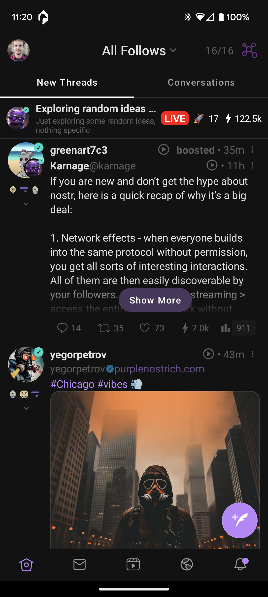
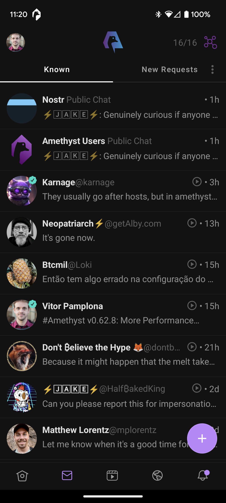
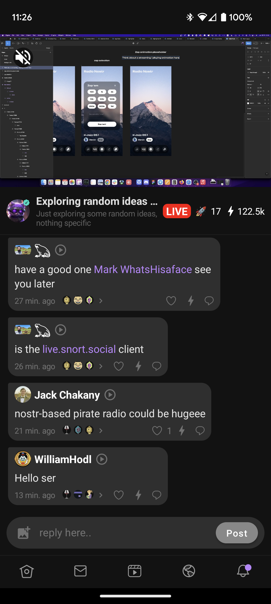
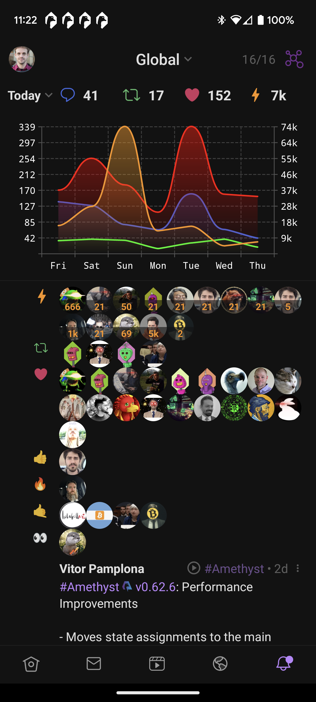

 <div align="center">

<a href="https://amethyst.social">
    
</a>

# Amethyst

## Nostr Client for Android

Join the social network you control.

[](https://github.com/vitorpamplona/amethyst/releases)
[](https://play.google.com/store/apps/details?id=com.vitorpamplona.amethyst)

[](https://github.com/vitorpamplona/amethyst)
[](https://jitpack.io/#vitorpamplona/amethyst)
[](https://github.com/vitorpamplona/amethyst/actions/workflows/build.yml)
[](/LICENSE)
[](https://deepwiki.com/vitorpamplona/amethyst)

## Download and Install

[](https://github.com/zapstore/zapstore/releases)
[](https://github.com/ImranR98/Obtainium)
[](https://github.com/vitorpamplona/amethyst/releases)
[](https://play.google.com/store/apps/details?id=com.vitorpamplona.amethyst)

</div>

## Supported Features



- [x] Events / Relay Subscriptions (NIP-01)
- [x] Follow List (NIP-02)
- [x] OpenTimestamps Attestations (NIP-03)
- [x] Private Messages (NIP-04 -- to be removed)
- [x] DNS Address (NIP-05)
- [x] Mnemonic seed phrase (NIP-06)
- [ ] WebBrowser Signer (NIP-07, Not applicable)
- [x] Old-style mentions (NIP-08)
- [x] Event Deletion (NIP-09)
- [x] Text Notes and Threads (NIP-10)
- [x] Relay Information Document (NIP-11)
- [x] Generic Tag Queries (NIP-12)
- [x] Proof of Work Display (NIP-13)
- [ ] Proof of Work Calculations (NIP-13)
- [x] Events with a Subject (NIP-14)
- [ ] Marketplace (NIP-15)
- [x] Event Treatment (NIP-16)
- [x] Private Direct Messages (NIP-17)
- [x] Image/Video/Url/LnInvoice/Cashu Previews
- [x] Reposts, Quotes, Generic Reposts (NIP-18)
- [x] Bech32 Encoding support (NIP-19)
- [x] Command Results (NIP-20)
- [x] URI Support (NIP-21)
- [x] Long-form Content (NIP-23) (view only)
- [x] User Profile Fields / Relay list (NIP-24)
- [x] Reactions (NIP-25)
- [ ] Delegated Event Signing (NIP-26, Will not implement)
- [x] Text Note References (NIP-27)
- [x] Public Chats (NIP-28)
- [ ] Relay-based Groups (NIP-29)
- [x] Custom Emoji (NIP-30)
- [x] Event alt descriptors (NIP-31)
- [ ] Labeling (NIP-32)
- [x] Git Stuff (NIP-34)
- [x] Torrents (NIP-35)
- [x] Sensitive Content (NIP-36)
- [x] Drafts (NIP-37)
- [x] User Status Event (NIP-38)
- [x] External Identities (NIP-39)
- [x] Expiration Support (NIP-40)
- [x] Relay Authentication (NIP-42)
- [ ] Relay Access Metadata and Requests (NIP-43)
- [x] Versioned Encrypted Payloads (NIP-44)
- [x] Event Counts (NIP-45)
- [o] Nostr Connect (NIP-46)
- [o] Wallet Connect API (NIP-47)
- [ ] Proxy Tags (NIP-48, Not applicable)
- [x] Encryption for import/export (NIP-49)
- [x] Relay Search (NIP-50)
- [x] Lists (NIP-51)
- [o] Calendar Events (NIP-52)
- [x] Live Activities & Live Chats (NIP-53)
- [x] Wiki (NIP-54)
- [x] Android Signer (NIP-55)
- [x] Reporting (NIP-56)
- [x] Lightning Tips
- [x] Zaps (NIP-57)
- [x] Zap Splits (NIP-57)
- [x] Private Zaps (NIP-57 / Draft)
- [x] Zapraiser (NIP-57 / Draft)
- [x] Badges (NIP-58)
- [x] Gift Wraps & Seals (NIP-59)
- [ ] Cashu Wallets (NIP-60)
- [ ] Nutzaps (NIP-61)
- [x] Request to Vanish (NIP-62)
- [x] Chess (NIP-64)
- [x] Relay List Metadata (NIP-65)
- [ ] Relay Discovery and Monitoring (NIP-66)
- [x] Picture-first feeds (NIP-68)
- [ ] Peer-to-peer Orders (NIP-69)
- [o] Protected Events (NIP-70)
- [x] Video Events (NIP-71)
- [x] Moderated Communities (NIP-72)
- [x] External Content IDs (NIP-73)
- [ ] Zap Goals (NIP-75)
- [ ] Negentropy Syncing (NIP-77)
- [x] Arbitrary Custom App Data (NIP-78)
- [ ] NIP-29 Threads (NIP-7D)
- [x] Highlights (NIP-84)
- [x] Trusted Assertions (NIP-85)
- [ ] Relay Management API (NIP-86)
- [ ] ECash Mint Discoverability (NIP-87)
- [x] Polls (NIP-88)
- [x] Relay Notify Request
- [x] Recommended Application Handlers (NIP-89)
- [x] Data Vending Machine (NIP-90)
- [x] Inline Metadata (NIP-92)
- [x] Verifiable file URLs (NIP-94)
- [x] Binary Blobs (NIP-95/Draft)
- [x] HTTP File Storage Integration (NIP-96)
- [x] HTTP Auth (NIP-98)
- [x] Classifieds (NIP-99)
- [x] Voice Messages (NIP-A0)
- [x] Public Messages (NIP-A4)
- [ ] Web Bookmarks
- [x] Blossom (NIP-B7)
- [ ] Nostr BLE Communications Protocol (NIP-BE)
- [ ] Code Snippets (NIP-C0)
- [ ] NIP-29 Chats (NIP-C7)
- [ ] MLS Protocol (NIP-EE)
- [x] Audio Tracks (zapstr.live) (kind:31337)
- [x] Push Notifications (Google and Unified Push)
- [x] In-Device Automatic Translations
- [x] Hashtag Following and Custom Hashtags
- [x] Login with QR
- [x] Bounty support (nostrbounties.com)
- [x] De-googled F-Droid flavor
- [x] Multiple Accounts
- [x] Markdown Support
- [x] Medical Data (NIP-xx/Draft)
- [x] Embed events (NIP-xx/Draft)
- [x] Edit Short Notes (NIP-xx/Draft)
- [ ] Relationship Status (NIP-xx/Draft)
- [ ] Signed Filters (NIP-xx/Draft)
- [ ] Key Migration (NIP-xx/Draft)
- [x] Image Capture in the app
- [x] Video Capture in the app
- [ ] Local Database
- [ ] Workspaces
- [ ] Infinity Scroll

## Privacy and Information Permanence

Relays know your IP address, your name, your location (guessed from IP), your pub key, all your contacts, and other relays, and can read every action you do (post, like, boost, quote, report, etc) except for Private Zaps and Private DMs. While the content of direct messages (DMs) is only visible to you and your DM counterparty, everyone can see when you and your counterparty DM each other.

If you want to improve your privacy, consider utilizing a service that masks your IP address (e.g. a VPN or Tor) from trackers online.

The relay also learns which public keys you are requesting, meaning your public key will be tied to your IP address.

Information shared on Nostr can be re-broadcasted to other servers and should be assumed permanent for privacy purposes. There is no way to guarantee the deletion of any content once posted.

# Development Overview

This repository is split between Amethyst, Quartz, Commons, and DesktopApp:
- **Amethyst** - Native Android app with Kotlin and Jetpack Compose
- **Quartz** - Nostr-commons KMP library for protocol classes shared across platforms
- **Commons** - Kotlin Multiplatform module with shared UI components (icons, robohash, blurhash, composables)
- **DesktopApp** - Compose Multiplatform Desktop application reusing commons and quartz

The app architecture consists of the UI, which uses the usual State/ViewModel/Composition, the service layer that connects with Nostr relays,
and the model/repository layer, which keeps all Nostr objects in memory, in a full OO graph.

The repository layer stores Nostr Events as Notes and Users separately. Those classes use LiveData and Flow objects to
allow the UI and other parts of the app to subscribe to each Note/User and receive updates when they happen.
They are also responsible for updating viewModels when needed. As the user scrolls through Events, the Datasource classes
are updated to receive more information about those particular Events.

Most of the UI is reactive to changes in the repository classes. The service layer assembles Nostr filters for each need of the app,
receives the data from the Relay, and sends it to the repository. Connection with relays is never closed during the use of the app.
The UI receives a notification that objects have been updated. Instances of User and Notes are mutable directly.
There will never be two Notes with the same ID or two User instances with the same pubkey.

Lastly, the user's account information (private key/pub key) is stored in the Android KeyStore for security.

## Setup

Make sure to have the following pre-requisites installed:
1. Java 21+
2. Android Studio
3. Android 8.0+ Phone or Emulation setup

Fork and clone this repository and import it into Android Studio
```bash
git clone https://github.com/vitorpamplona/amethyst.git
```

Use an Android Studio build action to install and run the app on your device or a simulator.

## Building

Build the Android app:
```bash
./gradlew assembleDebug
```

Build and run the Desktop app (requires Java 21+):
```bash
./gradlew :desktopApp:run
```

## Testing
```bash
./gradlew test
./gradlew connectedAndroidTest
```

## Linting
```bash
./gradlew spotlessCheck
./gradlew spotlessApply
```

## Installing on device

For the F-Droid build:
```bash
./gradlew installFdroidDebug
```

For the Play build:
```bash
./gradlew installPlayDebug
```

## Deploying

1. Generate a new signing key
```
keytool -genkey -v -keystore <my-release-key.keystore> -alias <alias_name> -keyalg RSA -keysize 2048 -validity 10000
openssl base64 < <my-release-key.keystore> | tr -d '\n' | tee some_signing_key.jks.base64.txt
```
2. Create four Secret Key variables on your GitHub repository and fill in the signing key information
    - `KEY_ALIAS` <- `<alias_name>`
    - `KEY_PASSWORD` <- `<your password>`
    - `KEY_STORE_PASSWORD` <- `<your key store password>`
    - `SIGNING_KEY` <- the data from `<my-release-key.keystore>`
3. Change the `versionCode` and `versionName` on `amethyst/build.gradle`
4. Commit and push.
5. Tag the commit with `v{x.x.x}`
6. Let the [Create Release GitHub Action](https://github.com/vitorpamplona/amethyst/actions/workflows/create-release.yml) build a new `aab` file.
7. Add your CHANGE LOG to the description of the new release
8. Download the `aab` file and upload it to the PlayStore.

## Using the Quartz library

### Installing

Add Maven Central and Google Maven to your repositories:

```gradle
repositories {
    mavenCentral()
    google()
}
```

Add the following line to your `commonMain` dependencies:

```gradle
implementation('com.vitorpamplona.quartz:quartz:1:05.0')
```

Variations to each platform are also available:

```gradle
implementation('com.vitorpamplona.quartz:quartz-android:1:05.0')
implementation('com.vitorpamplona.quartz:quartz-jvm:1:05.0')
implementation('com.vitorpamplona.quartz:quartz-iosarm64:1:05.0')
implementation('com.vitorpamplona.quartz:quartz-iossimulatorarm64:1:05.0')
```

Check versions on [MavenCentral](https://central.sonatype.com/search?q=com.vitorpamplona.quartz)

### How to use

Manage logged in users with the `KeyPair` class

```kt
val keyPair = KeyPair() // creates a random key
val keyPair = KeyPair("hex...".hexToByteArray())
val keyPair = KeyPair("nsec1...".bechToBytes())
val keyPair = KeyPair(Nip06().privateKeyFromMnemonic("<mnemonic>"))
val readOnly = KeyPair(pubKey = "hex...".hexToByteArray())
val readOnly = KeyPair(pubKey = "npub1...".bechToBytes())
```

Create signers that can be Internal, when you have the private key or a read-only public key,
or External, when it is controlled by Amber in NIP-55.

Use either the `NostrSignerInternal` or `NostrSignerExternal` class:

```kt
val signer = NostrSignerInternal(keyPair)
val amberSigner = NostrSignerExternal(
    pubKey = keyPair.pubKey.toHexKey(),
    packageName = signerPackageName, // Amber package name
    contentResolver = appContext.contentResolver,
)
```

Create a single `NostrClient` for the entire application and control which relays it will access by
registering subscriptions and sending events. The pool will automatically change based on filters +
outbox events.

You will need a coroutine scope to process events and if you are using OKHttp, we offer a basic
wrapper to create the socket connections themselves.

```kt
val appScope = CoroutineScope(Dispatchers.Default + SupervisorJob())
val rootClient = OkHttpClient.Builder().build()
val socketBuilder = BasicOkHttpWebSocket.Builder { url -> rootClient }

val client = NostrClient(socketBuilder, appScope)
```

If you want to auth, given a logged-in `signer`:

```kt
val authCoordinator = RelayAuthenticator(client, appScope) { authTemplate ->
    listOf(
        // for each signed-in user, return an event
        signer.sign(authTemplate)
    )
}
```

To make a request subscription simply do:

```kt
val metadataSub = client.req(
    relay = "wss://nos.lol",
    filter = Filter(
        kinds = listOf(MetadataEvent.KIND),
        authors = listOf(signer.pubkey)
    )
) { event ->
    /* consume event */
}
```

The client will add the relay to the pool, connect to it and start receiving events. The
`metadataSub` will be active until you call `metadataSub.close()`. If the client disconnects
and reconnects, the sub will be active again.

To manage subscriptions that change over time, the simplest approach is to build mutable
subscriptions with a filters lambda that you can change at will.

```kt
val metadataSub = client.req(
    filters = {
        // Let's say you have a list of users that need to be rendered
        val users = pubkeysSeeingInTheScreen()
        // And a cache repository with their outbox relays
        val outboxRelays = outboxRelays(users)

        val filters = listOf(
            Filter(
                kinds = listOf(MetadataEvent.KIND),
                authors = users
            )
        )

        outboxRelays.associateWith { filters }
    }
) { event ->
    /* consume event */
}
```

In that way, you can simply call `metadataSub.updateFilter()` when you need to update
subscriptions to all relays. Or call `metadataSub.close()` to stop the sub
without deleting it.

When your app goes to the background, you can use NostrClient's `connect` and `disconnect`
methods to stop all communication to relays. Add the `connect` to your `onResume` and `disconnect`
to `onPause` methods.

### Feature Parity Table

| Feature Category | Feature / Component | Android / JVM Support | iOS Support | Notes |
| :--- | :--- | :---: | :---: | :--- |
| **Cryptography** | Secp256k1 (Schnorr, Keys) | ✅ Full | ❌ No | Core Nostr signing/verification is missing on iOS. |
| | LibSodium (ChaCha20, Poly1305) | ✅ Full | ❌ No | AEAD and stream ciphers are unimplemented. |
| | AES Encryption (CBC & GCM) | ✅ Full | ❌ No | `AESCBC` and `AESGCM` are stubs on iOS. |
| | Hashing (SHA-256, etc.) | ✅ Full | ❌ No | `DigestInstance` is unimplemented. |
| | MAC (HmacSHA256, etc.) | ✅ Full | ❌ No | `MacInstance` is unimplemented. |
| **Data & Serialization** | JSON Mapping (Optimized) | ✅ Full | ❌ No | `OptimizedJsonMapper` is a stub; cannot parse/serialize Events. |
| | GZip Compression | ✅ Full | ❌ No | `GZip` implementation is missing. |
| | BitSet | ✅ Full | ❌ No | `BitSet` utility is unimplemented. |
| | LargeCache | ✅ Full | ❌ No | `LargeCache` methods (get, keys, size, etc.) are stubs. |
| **NIP Support** | NIP-96 (File Storage Info) | ✅ Full | ❌ No | `ServerInfoParser` is unimplemented. |
| | NIP-46 (Remote Signer) | ✅ Full | ⚠️ Partial | Some methods in `NostrSignerRemote` are unimplemented in `commonMain`. |
| | NIP-03 (OTS / Timestamps) | ✅ Full | ❌ No | `BitcoinExplorer` and `RemoteCalendar` have stubs in `commonMain`. |
| **Utilities** | URL Encoding / Decoding | ✅ Full | ❌ No | `UrlEncoder` and `URLs.ios.kt` are unimplemented. |
| | Unicode Normalization | ✅ Full | ❌ No | `UnicodeNormalizer` is a stub. |
| | Platform Logging | ✅ Full | ✅ Full | iOS uses `NSLog`, Android uses standard Log. |
| | Current Time | ✅ Full | ✅ Full | Implemented using `NSDate` on iOS. |


## Contributing

Issues can be logged on: [https://gitworkshop.dev/repo/amethyst](https://gitworkshop.dev/repo/amethyst)

[GitHub issues](https://github.com/vitorpamplona/amethyst/issues) and [pull requests](https://github.com/vitorpamplona/amethyst/pulls) here are also welcome. Translations can be provided via [Crowdin](https://crowdin.com/project/amethyst-social)

You can also send patches through Nostr using [GitStr](https://github.com/fiatjaf/gitstr) to [this nostr address](https://patch34.pages.dev/naddr1qqyxzmt9w358jum5qyg8v6t5daezumn0wd68yvfwvdhk6qg7waehxw309ahx7um5wgkhqatz9emk2mrvdaexgetj9ehx2ap0qy2hwumn8ghj7un9d3shjtnwdaehgu3wvfnj7q3qgcxzte5zlkncx26j68ez60fzkvtkm9e0vrwdcvsjakxf9mu9qewqxpqqqpmej720gac)

By contributing to this repository, you agree to license your work under the MIT license. Any work contributed where you are not the original author must contain its license header with the original author(s) and source.

# Screenshots

| FollowFeeds                              | ChatsGroup                              | LiveStreams                                    | Notifications                                          |
|-------------------------------------------|----------------------------------------------|-------------------------------------------------|--------------------------------------------------------|
|  |  |  |  |

# Contributors

<a align="center" href="https://github.com/vitorpamplona/amethyst/graphs/contributors">
  
</a>

# MIT License

<pre>
Copyright (c) 2023 Vitor Pamplona

Permission is hereby granted, free of charge, to any person obtaining a copy
of this software and associated documentation files (the "Software"), to deal
in the Software without restriction, including without limitation the rights
to use, copy, modify, merge, publish, distribute, sublicense, and/or sell
copies of the Software, and to permit persons to whom the Software is
furnished to do so, subject to the following conditions:

The above copyright notice and this permission notice shall be included in all
copies or substantial portions of the Software.

THE SOFTWARE IS PROVIDED "AS IS", WITHOUT WARRANTY OF ANY KIND, EXPRESS OR
IMPLIED, INCLUDING BUT NOT LIMITED TO THE WARRANTIES OF MERCHANTABILITY,
FITNESS FOR A PARTICULAR PURPOSE AND NONINFRINGEMENT. IN NO EVENT SHALL THE
AUTHORS OR COPYRIGHT HOLDERS BE LIABLE FOR ANY CLAIM, DAMAGES OR OTHER
LIABILITY, WHETHER IN AN ACTION OF CONTRACT, TORT OR OTHERWISE, ARISING FROM,
OUT OF OR IN CONNECTION WITH THE SOFTWARE OR THE USE OR OTHER DEALINGS IN THE
SOFTWARE.
</pre>
